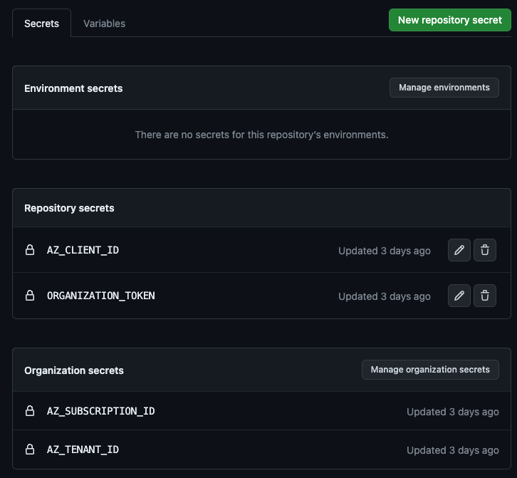
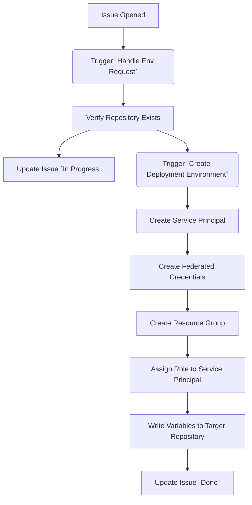

# Issue-Ops Azure Web-App with OIDC Authentication

This is a more sophisticated way for deployment, in that it uses GitHub Issues to trigger the creation of a full deployment environment on Azure (hence the term 'Issue Ops'). Additionally, rather than relying on secrets, it will use OIDC Authentication to conduct the deployment in a secure manner.

The main idea is that participants of the workshop:

1. Open an issue from an issue-form in this repository giving their target repository
2. This triggers a workflow that will:
    1. create an participant specific **App Registration** with a **Service Principal** that allows the repository to deploy using **OIDC**
    2. create a **Resource Group** in Azure that the **App Registration** is allowed to deploy to by a **Custom Role**
    3. puts the required OIDC Information (`AZ_CLIENT_ID`, `AZ_SUBSCRIPTION_ID` and `AZ_TENANT_ID`) and the `ResourceGroup` Name (`AZ_RESOURCE_GROUP`) into the target repository as secrets and action variables

With these variables and secrets, participants can follow the [Issue Ops Deployment Steps](tbd.) of the Actions-Workshop.

For a detailed explanation on how this works, see [Issue Ops Details](#how-it-works-in-detail) on the bottom of this doc.

## 1 Getting started

There are 3 pieces required to make this work:

1. [A GitHub Organization for the Actions Workshop with a copy of this Repository in it](#11-create-a-github-organization-for-the-workshop)
2. [A prepared Azure Account](#12-prepare-the-azure-account)
3. [A GitHub PAT for the Organization](#13-create-a-github-pat)

### 1.1 Create a GitHub Organization for the Workshop

1. [Create a (free) GitHub Organization](https://docs.github.com/en/github/setting-up-and-managing-organizations-and-teams/creating-a-new-organization-from-scratch)
2. `Use this template` of this very repository to create a copy in the organization
    

### 1.2 Prepare the Azure Account

#### Overview: Required Azure Resources

| Azure Resource | Name | Additional Info |
| ---- | ------ | ------ |
| [AD App Registration & Service Principal][ad-docs-create-service-principal] | GitHub Actions Workshop Administrator | This is the 'main' Service Principal used by this repository to create new participant specific Service Principals that allow them to deploy (App Registration and Service Principal are the same for our scenario here) |
| [Federated Credentials][ad-docs-federeated-github-credentials] | GitHub Actions Workshop Administrator | Using [this configuration](./resources/issue-ops/prepare-azure.sh#73), this is the OIDC configuration that is used by the participants create the participants Service Principals |
| [AD Admin Role Assignment][ad-docs-ad-admin-role-assignment] | Cloud Application Administrator | Built-In Azure AD Role, assigned to the GitHub Actions Workshop Administrator
| [Custom Role][ad-docs-create-custom-role-json] | GitHub Actions Workshop Administrator Role | Using [these permissions](./resources/issue-ops/prepare-azure.sh#126), this role allows the Administrator Service Principal has to create and cleanup resources |
| [Role Assignment][ad-docs-create-role-assignment] | GitHub Actions Workshop Administrator Role | Assigned to the GitHub Actions Workshop Administrator
| [Custom Role][ad-docs-create-custom-role-json] | Github Actions Workshop Participant Role | Using [these permissions](./resources/issue-ops/prepare-azure.sh#168), this is  role allows participanrt's Service Principals to deployment Azure Web-Apps via OIDC to the created Resource Group |

#### How to create these resources

If you want to use the Azure Portal, click on the links in the overview above for detailed instructions.

However, the easiest way to create all of the above is to execute the [./resources/issue-ops/prepare-azure.sh](../resources/issue-ops/prepare-azure.sh) script. To run it, spin up a Codespace and execute the following:

1. Login to Azure with

    ```shell
    az login --use-device-code
    ```

2. Define the Subscription Id to be used

    ```shell
    export AZ_SUBSCRIPTION_ID=<your-subscription-id>
    ```

3. Execute the script:

    ```shell
    ./resources/issue-ops/prepare-azure.sh
    ```

4. Make sure to store all the output values as Organization- and Repository Secrets as advised in the log output:

    | Secret Name        | Value                                                    | Scope |
    | ------------------ | -------------------------------------------------------- | ----- |
    | AZ_SUBSCRIPTION_ID | The Azure Subscription ID used above                     | Organization |
    | AZ_TENANT_ID       | The Azure Tenant ID used above                           | Organization |
    | AZ_CLIENT_ID       | The Azure Client ID of the created service principal     | Repository |

### 1.3 Create a GitHub PAT

1. Create the following GitHub PAT:

    **Owner: Your Workshop Organization**
    **Scopes**:

    | Name | Scope | Reason |
    | ---- | ----- | ------ |
    | Actions | Read and write | To be able to trigger workflows |
    | Metadata | Read | Check if the repository exists and is in current org |
    | Secrets | Read and write | Place the required variables into the target repository |
    | Variables | Read and write | Place the required variables into the target repository |

2. Create a  **Repository Secret `ORGANIZATION_TOKEN`**

After completion, you should have the following secrets in your copy of this deployment repository:



### 2 Conduct the Workshop

Hand out this repository's URL to your participants. Let them follow the [005-deployment-issue-ops.md Deployment step](https://github.com/actions-workshop/actions-workshop/tree/main/docs/005-deployment-azure-issue-ops.md) for the workshop, it contains the explanation on how to use this repository's issues to create a deployment environment.

### 3 Post Workshop Cleanup

After the workshop, you can easily cleanup all created resources by executing the [./resources/issue-ops/cleanup-azure.sh](../resources/issue-ops/cleanup-azure.sh) script:

1. Login to Azure (if not already logged in)

    ```shell
    az login --use-device-code
    ```

2. Execute the script:

    ```shell
    ./resources/issue-ops/cleanup-azure.sh
    ```

This will delete:

- All Resource Groups that participants created (identified by the tag `purpose=GitHub Actions Workshop`) with all their deployed services
- All Service Principals that were created for participants (identified by starting with the string `aw-`)
- All resources listed in [Overview: Required Azure Resources](#overview-required-azure-resources) that were created for the workshop (AD App Registration, Custom Roles, Role Assignments)

**You will be presented with a list of deleted resources and prompted to confirm before any deletion happens.**

> [!WARNING]
> As this script will remove all app registration / service principals that start with `aw-` (which stands for actions-workshop). You will get a list with confirmation before deletion, however, you should still make sure before tha you have no other app registrations / service principals that start with `aw-` in your subscription.

## How it works in Detail



1. There is an [Issue-Template](./github/ISSUE_TEMPLATE/create-deployment-environment.md) that contains an issue-form to ask for the target repository from which the deployment is supposed to be triggered.
2. Opening this issue triggers the [Handle Env Request](./.github/workflows/handle-env-request.yml) workflow, which:
   1. Verifies that the target repository exists
   2. Puts the given information into the correct format
   3. Triggers the downstream [Create Deployment Environment](./.github/workflows/create-deployment-environment.yml) workflow
   4. Creates a comment on the issue with the status of the deployment environment creation
3. The triggered [Create Deployment Environment](./.github/workflows/create-deployment-environment.yml) then executes several steps on Azure:
   1. It creates an **Azure AD Subscription** with a **Service Principal**
   2. It creates **Federated Credentials for OIDC Access** from the given repository and the `Staging` Environment
   3. It creates a **ResourceGroup** in Azure that acts as target for the deployment
   4. It assigns a **Role** that contains all permissions to deploy a Azure Web App to the Service Principal for the given ResourceGroup
   5. It writes the variables `AZ_RESOURCE_GROUP` and the `AZ_CLIENT_ID` into the repository's action variables

Once done, the participants can just easily use the [./resources/deploy-action.yml](./resources/deploy-action.yml) workflow in their repository to deploy to the created environment.

[ad-docs-create-service-principal]: https://learn.microsoft.com/en-us/azure/active-directory/develop/howto-create-service-principal-portal
[ad-docs-create-custom-role-json]: https://learn.microsoft.com/en-us/azure/role-based-access-control/custom-roles-portal#start-from-json
[ad-docs-create-role-assignment]: https://learn.microsoft.com/en-us/azure/role-based-access-control/role-assignments-portal
[ad-docs-federeated-github-credentials]: https://learn.microsoft.com/en-us/azure/developer/github/connect-from-azure?tabs=azure-portal%2Clinux
[ad-docs-ad-admin-role-assignment]: https://learn.microsoft.com/en-us/azure/active-directory/roles/manage-roles-portal
